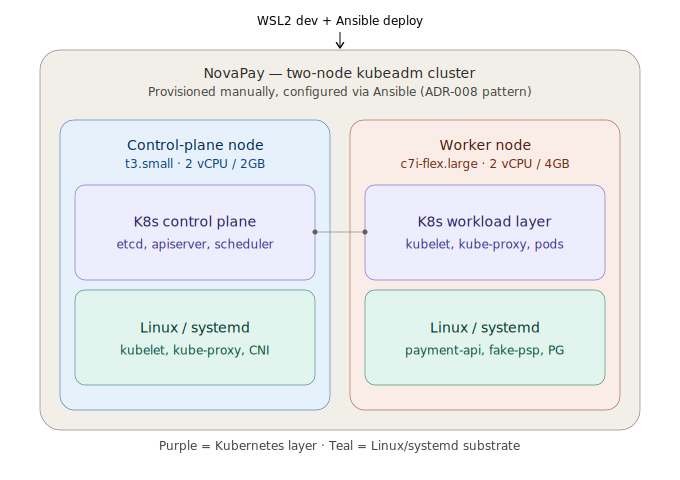

## Two-node Kubernetes architecture (added per ADR-014)

The payment-api/fake-psp/Postgres stack that ran alone on a single t3.micro
under systemd now runs as pods on the worker node of a two-node kubeadm
cluster. The control-plane node (t3.small) runs only cluster-management
processes (etcd, API server, scheduler, controller-manager) and no
application workload. The worker node (c7i-flex.large) is sized larger
because it carries real memory pressure: kubelet, kube-proxy, and the CNI
daemon coexist there with the full application stack.

Kubernetes is a layer of automation for systemd-managed processes, not a
replacement for the OS-level discipline this project already built. kubelet
itself is a systemd unit. The diagram's color coding reflects this
deliberately: purple marks the Kubernetes layer on both nodes, teal marks
the Linux/systemd substrate on both nodes -- the same colors regardless of
which node you're looking at, because it's the same relationship in both
places.

**Why Kubernetes, and not just deeper Linux administration:** some
incident classes this cluster will produce are genuine costume-changes of
work already done -- a NotReady kubelet is a systemd-unit problem
(ADR-011's territory); a pod eviction is the same cgroup mechanism INC-007
already demonstrated, one layer up. But others are structurally impossible
to produce on a single machine: etcd quorum loss is a distributed-consensus
problem with no single-node equivalent; cross-node scheduling and rolling
deployments only mean something once there's more than one instance to
coordinate. This project's target (Staff/Principal Cloud Engineer, per
ADR-014) is why this specific investment was chosen over staying
Linux-only -- a Linux Administrator target could have justified going
deeper on a single box instead.

**Infrastructure cost.** At the confirmed usage pattern (3 hours/day):
t3.small control-plane ~$1.87/month + c7i-flex.large worker ~$7.63/month =
~$9.50/month total (US baseline pricing; ap-south-2 regional pricing was
not confirmed at decision time -- verify via AWS Pricing Calculator before
relying on this figure for budgeting). A symmetric two-t3.small-node
alternative (~$3.74/month) was considered and set aside in favor of
worker-node headroom -- see ADR-014's Alternatives Considered for the full
reasoning. The prior t3.micro instance is retired once the app stack
migrates onto the worker node.
